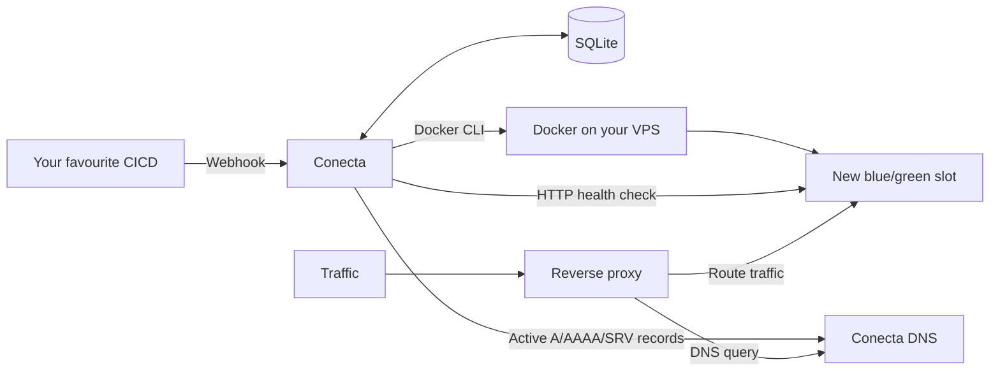

# Conecta

Conecta is a flexible, single-binary control plane for deploying Docker
applications on your VPS easily and with zero downtime. It sits somewhere
between a Kubernetes cluster and a fully managed SaaS platform: you get a
smoother deployment experience without having to run an entire platform.

You decide how to build and deploy your applications, and how to serve traffic.
Conecta is a tiny service-discovery and control-plane service that manages
rollouts, checks that the new container is healthy, and exposes the active slot
through DNS. The examples use Caddy, but you can use any reverse proxy that
fits your setup.

Use whatever workflow works best for you: GitHub Actions and a webhook, a local
build and a webhook, or any other CI/CD setup. Conecta does not lock you into a
Git provider, registry, proxy, or TLS termination solution.

## Why Conecta

I like deploying things on my VPS, but I also want the experience of a
Kubernetes cluster or a SaaS platform without all the time and maintenance
those systems require. I wanted something simple: deploy it once, and have it
just work. After trying a lot of approaches, I ended up building Conecta for
exactly that.

## How it works

Conecta keeps the moving parts small:

- SQLite stores project configuration and the last deployed tag.
- The Docker CLI starts and removes the blue/green application slots.
- HTTP health checks make sure the new slot is ready before traffic moves.
- Internal DNS publishes the active slot for your reverse proxy.
- A short propagation window lets existing DNS responses expire before the old
  slot is removed.



## What is included

- HTTP API for deploying and repeating rollouts.
- Internal authoritative DNS for `A`, `AAAA`, and `SRV` records.
- Blue/green switching with HTTP health checks.
- SQLite persistence at `/data/conecta.sqlite`.
- A single image based on Deno and the Docker CLI.

Conecta does not include a dashboard, CI/CD, or TLS certificates. Caddy, Traefik,
or another proxy must share the Docker network and query Conecta's DNS.

## Quick start

The complete example starts Conecta and Caddy on a shared Docker network:

```bash
cp .env.example .env
chmod 600 .env
mkdir -p env
docker compose -f examples/compose.yaml up --build -d
curl --fail http://127.0.0.1:3000/healthz
```

The example exposes Caddy at `http://127.0.0.1:8080`. To use a test
application, deploy an image with the webhook and visit that address:

```bash
curl --fail-with-body --request POST \
  http://127.0.0.1:3000/deploy/api \
  --header "Authorization: Bearer YOUR_API_KEY" \
  --header "Content-Type: application/json" \
  --data '{"config":{"name":"Demo API","image":"traefik/whoami","container_port":80,"health_path":"/","startup_timeout_seconds":60},"tag":"v1.10.3"}'

curl --fail http://127.0.0.1:8080
```

Adapt `examples/compose.yaml` and `examples/caddy/Caddyfile` for your domain,
TLS, and production network.

## Deployment flows

The webhook receives the project's complete configuration and the image tag:

```bash
curl --fail-with-body --request POST \
  https://conecta.example.com/deploy/api \
  --header "Authorization: Bearer YOUR_API_KEY" \
  --header "Content-Type: application/json" \
  --data '{"config":{"name":"Customer API","image":"ghcr.io/acme/api","container_port":3000,"health_path":"/healthz","startup_timeout_seconds":60,"env_file":"/data/env/api.env"},"tag":"sha-COMMIT_SHA"}'
```

The `tag` can come from GitHub Actions, a local build, or any automation. For a
private registry, store the token in `.env` and reference only its name:

```json
{
  "registry": {
    "username": "acme",
    "password_env": "REGISTRY_ACME_TOKEN"
  }
}
```

To repeat the last stored tag:

```bash
curl --fail-with-body --request POST \
  https://conecta.example.com/rollout/api \
  --header "Authorization: Bearer YOUR_API_KEY"
```

## Configuration

Copy `.env.example` to `.env` and change at least `CONECTA_API_KEY` to a random
secret. The variables are:

| Variable | Usage | Default value |
| --- | --- | --- |
| `HOSTNAME` / `PORT` | HTTP API | `0.0.0.0` / `3000` |
| `CONECTA_API_KEY` | Webhook authentication | Required |
| `CONECTA_DOCKER_NETWORK` | Conecta and application network | `conecta` |
| `CONECTA_DB_PATH` | SQLite database | `/data/conecta.sqlite` |
| `CONECTA_DNS_HOSTNAME` / `CONECTA_DNS_PORT` | DNS listener | `0.0.0.0` / `5353` |
| `CONECTA_DNS_ZONE` | Published private zone | `svc.internal` |
| `CONECTA_DNS_TTL_SECONDS` | DNS response TTL | `5` |
| `CONECTA_DNS_PROPAGATION_SECONDS` | Wait before removing the previous slot | `10` |

The TTL supports values from `0` to `3600`. Propagation must cover at least the
`refresh` configured in Caddy. `REGISTRY_*` credentials are additional
variables defined by each project; they are never sent in the webhook.

## DNS and proxy

For the `api` project and the `svc.internal` zone, Conecta publishes:

- `api.svc.internal` through `A`/`AAAA`.
- `_http._tcp.api.svc.internal` through `SRV`.

The proxy must resolve the `SRV` record and then the service destination using
`conecta:5353`. The included Caddy example shows this configuration.
